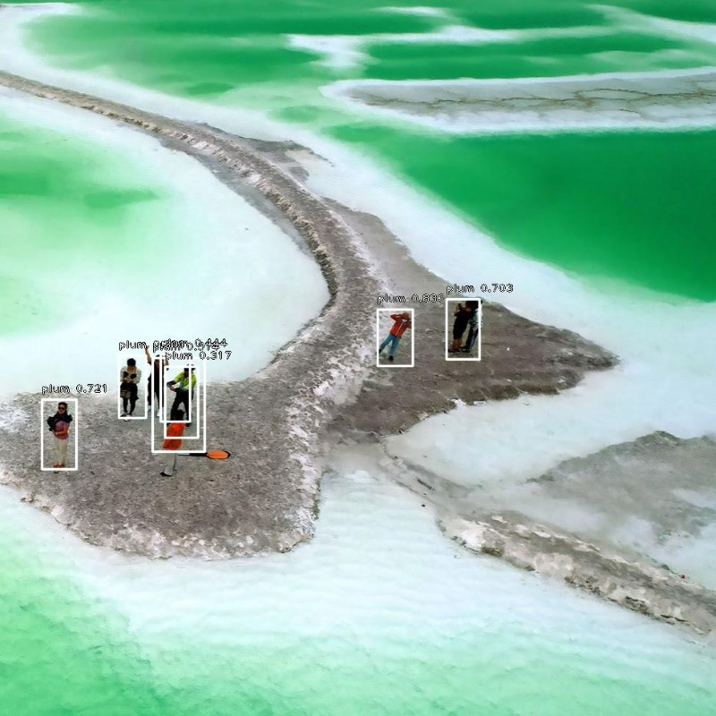
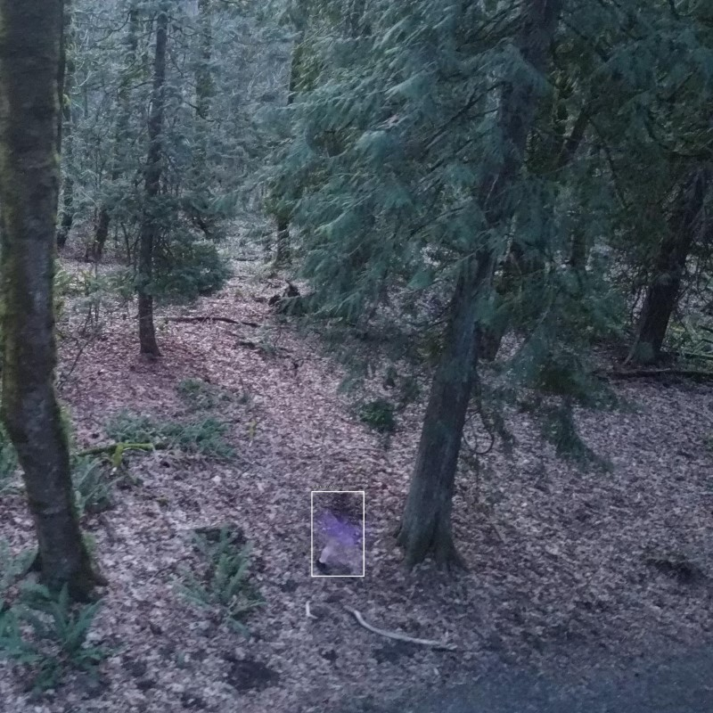
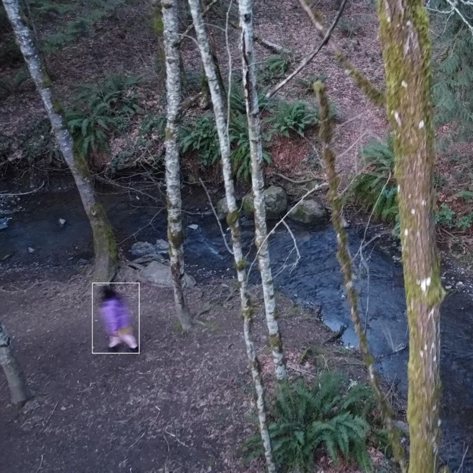
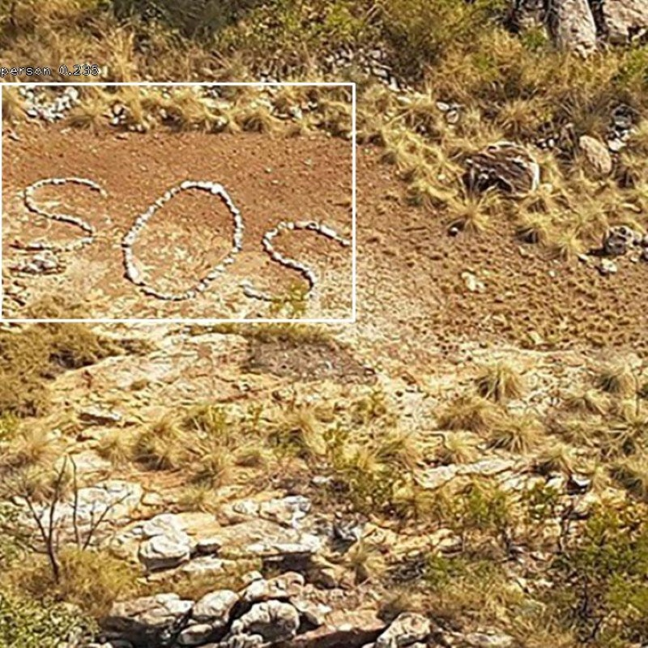

# SOS.Net Robust System to Harness the Power of AI for Search and Rescue Missions  [](https://travis-ci.org/fizyr/keras-retinanet) [](https://zenodo.org/badge/latestdoi/100249425)

SOS.Net is based on Keras implementation of RetinaNet object detection as described in [Focal Loss for Dense Object Detection](https://arxiv.org/abs/1708.02002) by Tsung-Yi Lin, Priya Goyal, Ross Girshick, Kaiming He and Piotr Dollár. 

SOS.Net provides all the tools you need to train drone images for Search and Rescue work.

## Installation (Linux Only)
0) Install Python 3.6
1) Create a project folder called sos
2) Create Python Virtual Enviornment.
   Install TensorFlow 2.4
3) Clone this repository.
4) In the repository, execute `pip install .`.  
5) Alternatively, you can run the code directly from the cloned  repository, however you need to run `python setup.py build_ext --inplace` to compile Cython code first.
6) Optionally, install `pycocotools` if you want to train / test on the MS COCO dataset by running `pip install --user git+https://github.com/cocodataset/cocoapi.git#subdirectory=PythonAPI`.

## Development Tools
Visual Studio Code (you can ssh to Linux from Windows or Mac)
Download labelImg from http://tzutalin.github.io/labelImg/
Windows PowerToy to rename and resize pictures

## Dataset
Download images from your drone (You can connect DJ2Mini, directly to your laptop)
Use Power Topy Rename tool change images file names
Open labelImg, open your image folder
Select PascalVOC (left side button)
Open one image at a time and draw a box to annotate (create RecBox button)

Create the following folders structure to train

```
sosVOS/
      Annotations/               #Annotated xml files of all images (training, validation and testing)
      JPEGImages/                #all images (jpg or png)
      ImageSets/
               Main/
                   test.txt      #Names of test images only. (add new line at end)
                   train.txt     #Names of training images only (70%?). (add new line at end)
                   trainval.txt  #names of all images (remove extension)
                   val.txt       #names of validation images only
```


## Step-by-step Instructions

### INITIAL SETUP

Do this only once. When you login again, go to home directory and run the command `source sosenv/bin/activate`.

```
#SETUP ENVIRONMENT
#home directory
mkdir /home/sos.net/
cd /home/sos.net/
#Create virtual environment and connect
python3 -m venv --copies sosenv
source sosenv/bin/activate
#after previous step, you should see (sosenv), prefixed to terminal
pip install --upgrade pip

#install TensorFlow
pip install tensorflow==2.3.0
#install other packages
pip install .
python setup.py build_ext --inplace

#we need Keras 2.4, instead of 2.3.
pip install keras==2.4.1

#you are all set
```

### TRAINING

Do this only once. When you login again, go to home directory and run the command `source sosenv/bin/activate`.

Please keep the list as is, if you want to continue to train our trained model (in model folder) but you can add more at the end in file `keras_retinanet/preprocessing/pascal_voc.py`

```
voc_classes = {
    'person'      : 0,
    'flag'        : 1,
    'SOS'         : 2,
    'dog'         : 3,
    'backpack'    : 4,
    'jacket'      : 5,
    'horse'       : 6
}
```
Then follow these step to train the model with your images.

Please download last snappoint of my training from this [link](https://drive.google.com/file/d/111cTgEaHRkhjURit0uHgVy-WWO8x1KxG/view?usp=sharing).

```
#--steps should be number of images in sosVOS/ImageSets/Main/train.txt
#--snapshot-path (checkpoints of training is saved after every epoch)
python keras_retinanet/bin/train.py --batch-size 1  --snapshot-path snapshots --random-transform --steps 45  pascal /home/tf23/sosVOC
#If you are training on top of our model, please add snap shot in model folder
python keras_retinanet/bin/train.py --batch-size 1 --snapshot model/resnet50_pascal_29.h5  --snapshot-path snapshots --random-transform --steps 45  pascal /home/tf23/sosVOC
```

Create Inference Model from snapshot
After training, we need to create inference model, by striping out training snippets in check point as we don't need them for inferencing

```
python keras_retinanet/bin/convert_model.py snapshots/resnet50_pascal_29.h5 models/resnet50_pascal_all.h5
```

### INFERENCE

Edit the following lines in `infer.py` and run the command

```
model_path = '../../models/resnet50_pascal_all.h5'
image_path = '../../images/sos4.jpg'
image_output_path = '../../images/sos4_detected.jpg'
```

Now, run the inference

```
python infer.py
```

## Sample Predictions

| predictions  | predictions |
| ------------- | ------------- |
| ||
| ||
| ||

## Help
If you need any help, create an issue and I will do my best to answer. 
Thank you. Nesara Shree
